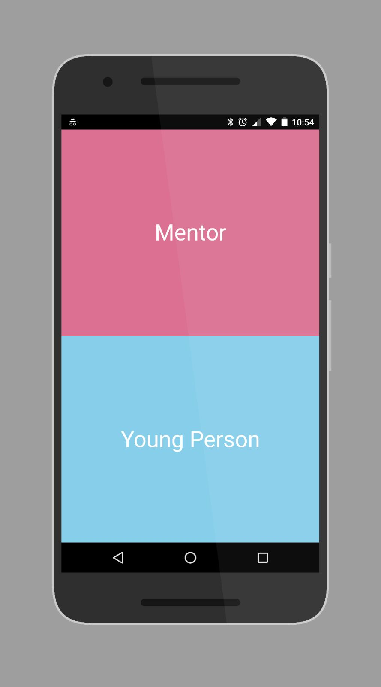

# Mentorista

Mentorista matches young people who want to work towards a self-development goal with
Mentors who are experienced in this field and can help them achieve this.

Mentorista also provides the infrastructure in the form of an interactive timeline to assist
the young person in visualising this goal with of smaller weekly milestones.

#### Problem:
[The Anna Freud Centre](http://www.annafreud.org/) are suffering from two key issues with their current process of matching young people with mentors:

1. There is no central database of mentors and their skills.
2. Development plans created for the young people are on paper which can be damaged or lost and is not easily accessible.

#### Tech Stack
- React
- Styled Components
- React Router
- LocalForage (Local Storage)

#### MVP Goals
- [x] User can choose whether they are a young person or mentor
- [x] Form for young person to input development plan goals
- [x] Dynamic and interactive timeline
- [x] Todo list: add item, check item, delete item

#### MVP Stretch Goals
- [x] Progressive Web Application & Offline Storage
- [x] Animations and Transitions

#### Future Goals
- Database
- Mentor Flow
- Matching Functionality
- Push Notifications for matches
- Support for multiple goals and timelines 
